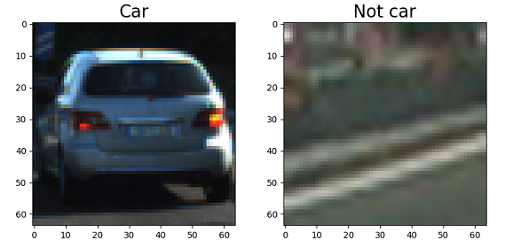
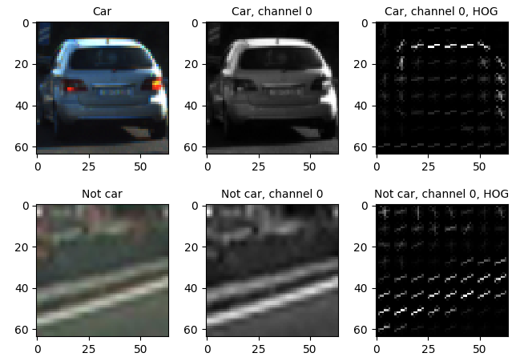
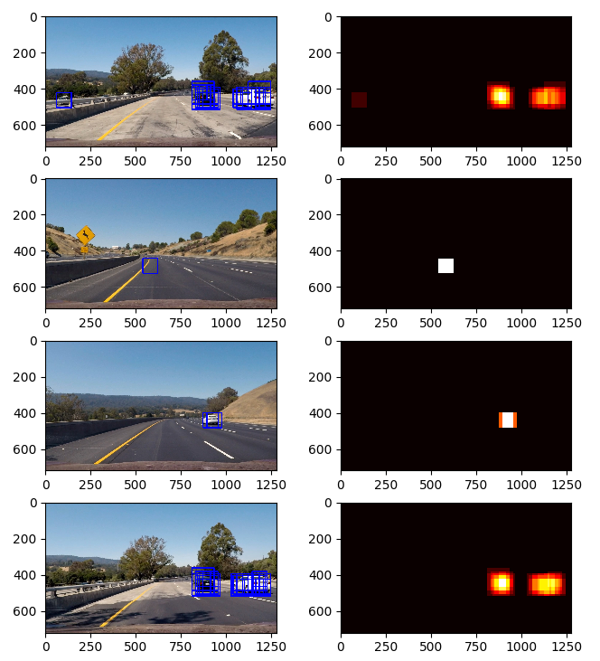
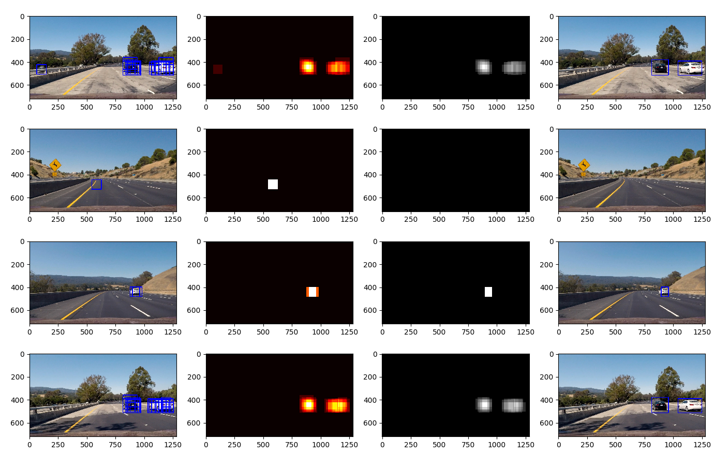

# Vehicle Detection Project

The present file illustrates my solution to the [Udacity Vehicle Detection Project](https://github.com/udacity/CarND-Vehicle-Detection).

[](https://www.youtube.com/watch?v=cNEpPq1f3nU)

---

The goals / steps of this project are the following:

* Perform a Histogram of Oriented Gradients (HOG) feature extraction on a labeled training set of images and train a classifier Linear SVM classifier
* Optionally, you can also apply a color transform and append binned color features, as well as histograms of color, to your HOG feature vector. 
* Note: for those first two steps don't forget to normalize your features and randomize a selection for training and testing.
* Implement a sliding-window technique and use your trained classifier to search for vehicles in images.
* Run your pipeline on a video stream (start with the test_video.mp4 and later implement on full project_video.mp4) and create a heat map of recurring detections frame by frame to reject outliers and follow detected vehicles.
* Estimate a bounding box for vehicles detected.

---

## [Rubric Points](https://review.udacity.com/#!/rubrics/513/view)

**Here I will consider the rubric points individually and describe how I addressed each point in my implementation.**

---

### Writeup / README

##### 1. Provide a Writeup / README that includes all the rubric points and how you addressed each one.  
This is the present file.

---

### Histogram of Oriented Gradients (HOG)

##### 1. Explain how you extracted HOG features from the training images.

I created a function called `get_training_data` at the line 97 of file `car_detection.py`.

It loads all the training data into two separate lists to identify which images are cars and which are not.



I then explored different color spaces and different `skimage.hog()` parameters (`orientations`, `pixels_per_cell`, and `cells_per_block`).

I decided to use the channel Y in the YCrCb color space and following hog parameters:  `orientations=9`, `pixels_per_cell=(8, 8)` and `cells_per_block=(2, 2)`.



##### 2. Explain how you settled on your final choice of HOG parameters.

I tried different color spaces and channels and wanted to choose a channel that had little noise to have a more representative HOG. This made me choose initially the Y channel of YCrCb. I then decided to add the other channels as well because I had better results with the classifier, that still need to be taken carefully with likelihood of overfitting (see note in section 3 below).

As for the parameters of the HOG function, I decided to settle on 9 orientations which is a pretty common value and cover well the angles. Using 8x8 pixels per cell and 2x2 cells per block covered well the small data samples and gave me good results when training my classifier so I kept those values. They could be improved at a later stage by doing a random grid search on the classifier.

##### 3. Describe how you trained a classifier using your selected HOG features (and color features if you used them).

I created a function called `train_car_data_set` at the line 186 of file `car_detection.py`.

I use a function called `extract_features` which extracts and combines several features from an image:
* value of pixels from each channel on a resized image (usually smaller)
* histogram of pixel values within a certain range
* HOG features from all channels in the YCrCb color space

I extracted these features from the entire data set, separating cars and non-cars. Then I normalized them (bringing each parameter to a zero-mean and same standard deviation) using `sklearn.preprocessing.StandardScaler()` to have a more efficient training.
I split the entire data set into a training and a test sets through `sklearn.model_selection.train_test_split` and trained with a SVM classifier through `sklearn.svm.SVC`. I obtained an accuracy above 99%.

*Note: The model probably suffered from overfitting due to the fact that most of the data is very similar since it comes from a video feed. It could be improved at a later stage by using the timestamps to ensure that the training and test sets are considering different moments.*

---

### Sliding Window Search

##### 1. Describe how you implemented a sliding window search.  How did you decide what scales to search and how much to overlap windows?

I created a function called `find_cars` at line 223 of `car_detection.py`.

I decided to first calculate the HOG parameters for the entire window and then extract the relevant ones for different sliding windows in order to decrease the impact of the slow calculation of HOG parameters. Since the parameters of HOG were then pre-calculated, the speed depended mainly on resizing pictures to extract spatial and histogram features, as well as running the classifier prediciton.

I decided to slide by 2 pixels each window to ensure I would cover well each frame and I used 2 different scales (1. and 2.) in comparison to the size of training data (64 x 64 pixels). This let me remove some false positives by enforcing the requirement that car detections needed to be confirmed by at least 2 different windows placed next to each other. Those 2 scales appeared to be sufficient to cover well all the frames from the test video.



##### 2. Show some examples of test images to demonstrate how your pipeline is working.  What did you do to optimize the performance of your classifier?

In order to have better performance on my classifier, I decided to apply the following principles:

* After sliding windows on 2 different scales all over the frame, I needed to have at least 2 positive detections in order for a pixel to be part of a detected car.
* When creating the heatmap of positive detections, I added a margin around the detected windows to compensate for the requirement of being part of 2 positive detections, which has a negative effect on the borders that can only be part of 1 positive detection.



---

### Video Implementation

##### 1. Provide a link to your final video output.

I combined the final video output with my previous solution of [Advanced Lane Finding Project](https://github.com/borisd13/CarND-Advanced-Lane-Lines) through the file `main.py`.

Here's a [link to my video result](./output_images/project_video_processed.mp4).


##### 2. Describe how you implemented some kind of filter for false positives and some method for combining overlapping bounding boxes.

I created the class `Car_boxes` at line 419 of `car_detection.py`.

The following principles were then applied:

* I would define bounding boxes per previously described methodology on single frames.
* I would in memory bounding boxes associated to 30 consecutive frames (slightly more than 1 second).
* If some pixels had been detected in more than 40% of the frames, they would be defined as potentially being part of a detected car.
* I would ensure that the final detected boxes were larger than a minimal size to eliminate any eventual false positive.

```python
# check that the detected box is large enough and not just likely an error
if (np.max(nonzerox) - np.min(nonzerox) > min_size_box_x) and (
        np.max(nonzeroy) - np.min(nonzeroy) > min_size_box_y):
    accurate_bbox_list.append(bbox)
```

---

### Discussion

##### 1. Briefly discuss any problems / issues you faced in your implementation of this project.  Where will your pipeline likely fail?  What could you do to make it more robust?

It was challenging to detect well the cars on all frames while rejecting false positives. A lot of trial and error was necessary, with optimization of parameters such as the number of consecutive frames considered, the size of scale for detection of cars, the threshold used on single frames to reject false positives, the threshold used on consecutive detections, the minimum detected window size, etc.

To further improve this project, I would probably consider using a deep learning approach on the car detection classifier to see if I could obtain better results. I would also most likely used transfer learning on a popular model used on a very large data set.

Finally, here are the challenges that could cause this pipeline to fail:

* lack of training in different conditions (night, rain, snow)
* lack of training on different kind of roads (bridges, muddy tracks)
* lack of training on more kind of vehicles (trucks, motorbikes)

Most importantly, despite the fact that this pipeline seems pretty robust, it is extremely slow and required 15mn to analyze 1mn of video. Therefore it could not be implemented in real life as-is. It would need to be analyzed in detail and the slowest components would need to be clearly improved with a faster execution, maybe with faster implementations of some functions in C but also with more efficient algorithms.
